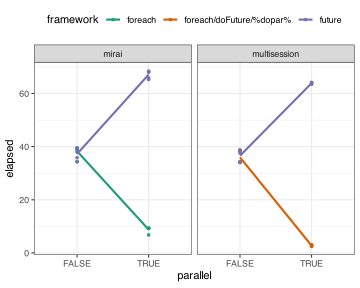
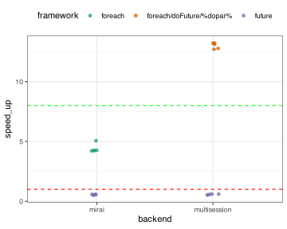
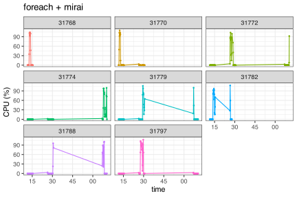
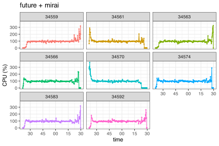
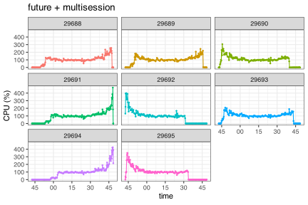

The tidymodels group is completing its transition from using the foreach package for parallel processing, moving to the future framework. 
 
I was working on doing this for our infrastructure in the tune package to conduct bootstrap confidence intervals for model performance statistics (e.g., area under the ROC curve, R<sup>2</sup>, etc). 
 
When running test cases, I noticed that parallel processing was taking longer than sequential execution. This is expected for tasks that are already very fast. However, in this application, I was splitting 30,000 tasks across 10 workers, so I was expecting, at worst, to break even in terms of execution time. 
 
While looking at the macOS Activity Monitor, no more than 2-3 workers were doing anything at any specific time, and the utilization seemed to be hopping around between worker processes a lot. To quantify/check this, I used Simon’s syrup port and found that there was a saw-toothed pattern to the percent CPU data: 


::: {.cell layout-align="center"}
::: {.cell-output-display}
{fig-align='center' width=90%}
:::
:::


 
Each panel represents how much CPU was being used by one of the worker subprocesses. With this many tasks, we would normally see the line go near 100% and then fall back to zero (with no inactivity in between). These data were generated using the future package with a multisession backend. 

## Reprex

We need a _small_ reproducible example to test with, so I simplified the task so that we didn’t need all of the tidymodels infrastructure. For these tests, I simulate 10,000 data points of observed and predicted values, then compute four performance statistics using the yardstick package. 
 
The original problems differ slightly from this since we compute metrics for different model candidates within each data set; basically, the original code has a short `for` loop inside of it.

 There are five R scripts that run the benchmarks under different scenarios. The foreach cases are used as a control. Each run of the scripts produces a baseline sequential result that uses `lapply()`. Each as run five times in a stratified random order
 
### `parallel_metrics_foreach_only.R`
 
 Runs foreach using a psock cluster. Pseudocode:
 
```r
foreach(i = boot_size, .packages = pkgs) %dopar%
  compute_metrics(rsamples)
``` 
 
### `parallel_metrics_foreach_mirai.R`

  Runs foreach using a mirai cluster (via `mirai:: make_cluster()`). Pseudocode is the same
 
```r
foreach(i = boot_size, .packages = pkgs) %dopar%
  compute_metrics(rsamples)
``` 
 
### `parallel_metrics_foreach_doFuture.R`
 
 Use the doFuture package to setup the multisession (=psock) workers and still be the standard foreach operator 
 
 ```r
registerDoFuture()
plan(multisession)

foreach(i = boot_size, .packages = pkgs) %dopar%
  compute_metrics(rsamples)
``` 

### `parallel_metrics_future_multisession.R`

Basic future code (via future.apply) using a multisession plan: 

 ```r
plan(multisession)

future_lapply(
    resamples,
    compute_metrics,
    future.packages = c("rsample", "yardstick"),
    future.globals = c("compute_metrics")
  )
``` 

### `parallel_metrics_future_mirai.R`

Same but using mirai directly via future.mirai:

 ```r
plan(mirai_multisession)

future_lapply(
    resamples,
    compute_metrics,
    future.packages = c("rsample", "yardstick"),
    future.globals = c("compute_metrics")
  )
``` 

## Running the Tests

There are a few packages to install: 

::: {.cell}

```{.r .cell-code}
pkgs <- c("doFuture", "doParallel", "dplyr", "foreach", "future.mirai", 
          "future.apply", "ggplot2", "mirai", "parallelly", "purrr", "rsample", 
          "sessioninfo", "simonpcouch/syrup", "yardstick")
```
:::

We recommend using the pak package to install them: 

```r
pak::pak(pkgs, ask = FALSE)
```

To produce the results, run `go.sh` in a terminal from the root of this repository and more results are generated. You will not get the same numbers as those shown here. Using an Apple M3 Pro MacBook Pro, the script takes about 25 minutes to run. 

## Results


Unlike the original task, the results show that parallel processing is speeding things up to various degrees. The fastest was using foreach with doFuture (more on this below). On average, mirai was faster than multisession, most likely because its allocation of tasks to workers is dynamic. 


::: {.cell layout-align="center"}
::: {.cell-output-display}
{fig-align='center' width=70%}
:::
:::


When viewed as speed-ups:


::: {.cell layout-align="center"}
::: {.cell-output-display}
{fig-align='center' width=70%}
:::
:::


The best speed-ups were around 13-fold. This is good but should probably be higher since 8 cores were used in parallel. The other combinations ranged between 1.5-fold to about 3-fold. 

## CPU Itilization

CPU usage was recorded for the workers every 0.05 seconds. We can see how each case behaved. In the plots below, each facet is a worker process (the value in the banner is the process ID).

First, the winner: foreach with doFuture has the best speed-ups but from the CPU data, this is inexpiable since only one worker appears to be doing anything (this is consistent across the five runs): 


::: {.cell layout-align="center"}

:::


¯\\_(ツ)_/¯

mirai (with foreach) was trying harder to maintain utilization, but it significantly fluctuates with periods of inactivity.  


::: {.cell layout-align="center"}
::: {.cell-output-display}
{fig-align='center' width=100%}
:::
:::


Switching to using mirai with future showd utilization ramping up but, overall, has speed-ups less than 3-fold using 8 workers. 


::: {.cell layout-align="center"}
::: {.cell-output-display}
{fig-align='center' width=100%}
:::
:::


Finally, future and multisession showed a pattern that approximated our original results. 


::: {.cell layout-align="center"}
::: {.cell-output-display}
{fig-align='center' width=100%}
:::
:::


## Session Info


The versions that I had when running these: 


::: {.cell}
::: {.cell-output .cell-output-stdout}

```
─ Session info ───────────────────────────────────────────────────────────────
 setting  value
 version  R version 4.5.0 (2025-04-11)
 os       Ubuntu 24.04.2 LTS
 system   x86_64, linux-gnu
 ui       X11
 language en_GB:en
 collate  en_GB.UTF-8
 ctype    en_GB.UTF-8
 tz       Europe/London
 date     2025-05-05
 pandoc   3.2 @ /usr/lib/rstudio/resources/app/bin/quarto/bin/tools/x86_64/ (via rmarkdown)
 quarto   1.6.40 @ /usr/local/bin/quarto

─ Packages ───────────────────────────────────────────────────────────────────
 package      * version    date (UTC) lib source
 bench        * 1.1.4      2025-01-16 [1] CRAN (R 4.5.0)
 callr          3.7.6      2024-03-25 [1] CRAN (R 4.5.0)
 cli            3.6.5      2025-04-23 [1] CRAN (R 4.5.0)
 codetools      0.2-20     2024-03-31 [4] CRAN (R 4.4.0)
 cpp11          0.5.2      2025-03-03 [1] CRAN (R 4.5.0)
 digest         0.6.37     2024-08-19 [1] CRAN (R 4.5.0)
 doFuture     * 1.0.2      2025-03-16 [1] CRAN (R 4.5.0)
 doParallel   * 1.0.17     2022-02-07 [1] CRAN (R 4.5.0)
 dplyr        * 1.1.4      2023-11-17 [1] CRAN (R 4.5.0)
 fansi          1.0.6      2023-12-08 [1] CRAN (R 4.5.0)
 farver         2.1.2      2024-05-13 [1] CRAN (R 4.5.0)
 foreach      * 1.5.2      2022-02-02 [1] CRAN (R 4.5.0)
 furrr          0.3.1      2022-08-15 [1] CRAN (R 4.5.0)
 future       * 1.40.0     2025-04-10 [1] CRAN (R 4.5.0)
 future.apply * 1.11.3     2024-10-27 [1] CRAN (R 4.5.0)
 future.mirai * 0.2.2      2024-07-03 [1] CRAN (R 4.5.0)
 generics       0.1.3      2022-07-05 [1] CRAN (R 4.5.0)
 ggplot2      * 3.5.2      2025-04-09 [1] CRAN (R 4.5.0)
 globals        0.17.0     2025-04-16 [1] CRAN (R 4.5.0)
 glue           1.8.0      2024-09-30 [1] CRAN (R 4.5.0)
 gtable         0.3.6      2024-10-25 [1] CRAN (R 4.5.0)
 hardhat        1.4.1      2025-01-31 [1] CRAN (R 4.5.0)
 isoband        0.2.7      2022-12-20 [1] CRAN (R 4.5.0)
 iterators    * 1.0.14     2022-02-05 [1] CRAN (R 4.5.0)
 labeling       0.4.3      2023-08-29 [1] CRAN (R 4.5.0)
 lattice        0.22-5     2023-10-24 [4] CRAN (R 4.3.3)
 lifecycle      1.0.4      2023-11-07 [1] CRAN (R 4.5.0)
 listenv        0.9.1      2024-01-29 [1] CRAN (R 4.5.0)
 magrittr       2.0.3      2022-03-30 [1] CRAN (R 4.5.0)
 MASS           7.3-65     2025-02-28 [4] CRAN (R 4.4.3)
 Matrix         1.7-3      2025-03-11 [4] CRAN (R 4.4.3)
 mgcv           1.9-1      2023-12-21 [4] CRAN (R 4.3.2)
 mirai        * 2.2.0      2025-03-20 [1] CRAN (R 4.5.0)
 nanonext       1.5.2.9014 2025-05-05 [1] local
 nlme           3.1-168    2025-03-31 [4] CRAN (R 4.4.3)
 parallelly   * 1.43.0     2025-03-24 [1] CRAN (R 4.5.0)
 pillar         1.10.2     2025-04-05 [1] CRAN (R 4.5.0)
 pkgconfig      2.0.3      2019-09-22 [1] CRAN (R 4.5.0)
 processx       3.8.6      2025-02-21 [1] CRAN (R 4.5.0)
 profmem        0.7.0      2025-05-02 [1] CRAN (R 4.5.0)
 ps             1.9.1      2025-04-12 [1] CRAN (R 4.5.0)
 purrr        * 1.0.4      2025-02-05 [1] CRAN (R 4.5.0)
 R6             2.6.1      2025-02-15 [1] CRAN (R 4.5.0)
 RColorBrewer   1.1-3      2022-04-03 [1] CRAN (R 4.5.0)
 rlang          1.1.6      2025-04-11 [1] CRAN (R 4.5.0)
 rsample      * 1.3.0      2025-04-02 [1] CRAN (R 4.5.0)
 scales         1.4.0      2025-04-24 [1] CRAN (R 4.5.0)
 sessioninfo  * 1.2.3      2025-02-05 [1] CRAN (R 4.5.0)
 slider         0.3.2      2024-10-25 [1] CRAN (R 4.5.0)
 sparsevctrs    0.3.3      2025-04-14 [1] CRAN (R 4.5.0)
 stringi        1.8.7      2025-03-27 [1] CRAN (R 4.5.0)
 stringr        1.5.1      2023-11-14 [1] CRAN (R 4.5.0)
 syrup        * 0.1.3.9000 2025-05-05 [1] Github (simonpcouch/syrup@6720ecd)
 tibble         3.2.1      2023-03-20 [1] CRAN (R 4.5.0)
 tidyr          1.3.1      2024-01-24 [1] CRAN (R 4.5.0)
 tidyselect     1.2.1      2024-03-11 [1] CRAN (R 4.5.0)
 utf8           1.2.5      2025-05-01 [1] CRAN (R 4.5.0)
 vctrs          0.6.5      2023-12-01 [1] CRAN (R 4.5.0)
 viridisLite    0.4.2      2023-05-02 [1] CRAN (R 4.5.0)
 warp           0.2.1      2023-11-02 [1] CRAN (R 4.5.0)
 withr          3.0.2      2024-10-28 [1] CRAN (R 4.5.0)
 yardstick    * 1.3.2      2025-01-22 [1] CRAN (R 4.5.0)

 [1] /home/cg334/R/x86_64-pc-linux-gnu-library/4.5
 [2] /usr/local/lib/R/site-library
 [3] /usr/lib/R/site-library
 [4] /usr/lib/R/library
 * ── Packages attached to the search path.

──────────────────────────────────────────────────────────────────────────────
```


:::
:::
